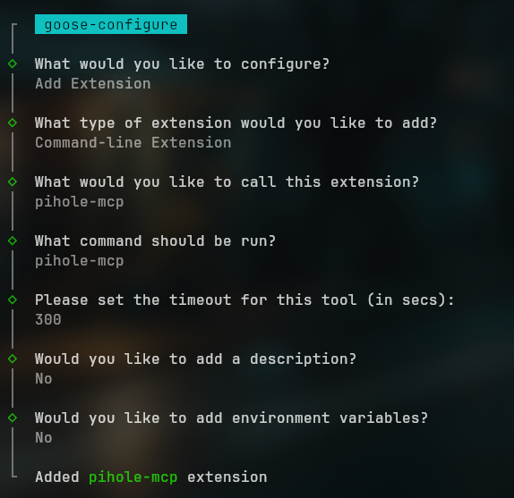
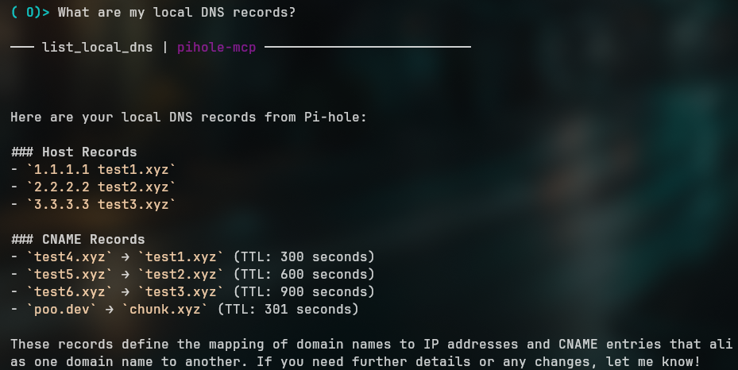
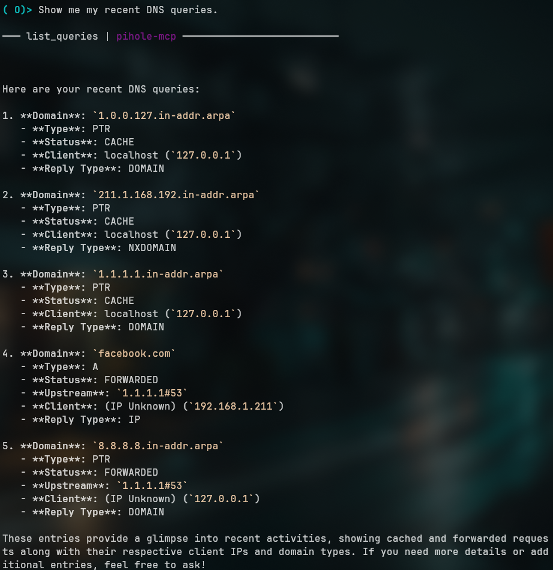

# pihole-mcp-serer

A Model Context Protocol (MCP) server for Pi-hole. This server exposes Pi-hole functionality as tools that can be used by AI assistants.

## Features

- **ListLocalDNS**: Returns all local DNS settings from Pi-hole
- **ListQueries**: Returns recent DNS query history from Pi-hole

## Dependencies

### `uv`

Install `uv` with your package manager (`brew`, `apt`, `pacman`, etc.).

## Setup

1. Create a `.env` file in the project root with your Pi-hole credentials:
   ```
   PIHOLE_URL=https://your-pihole.local/
   PIHOLE_PASSWORD=your-admin-password
   ```

2. Install dependencies:
   ```
   uv add "mcp[cli]" pihole6api python-dotenv
   ```

## Development

To run the server in development mode:
```
uv run mcp dev main.py
```

While the development server is running, navigate to `http://127.0.0.1:6274` in a local browser.

## API

This MCP server exposes two tools:

- `list_local_dns`: Lists all local DNS settings from Pi-hole
- `list_queries`: Fetches the recent DNS query history from Pi-hole

These tools can be used by AI assistants that support the MCP protocol.

## Testing in `goose`

Goose is a CLI LLM client that's useful for testing and development. Follow their install instructions [here](https://block.github.io/goose/docs/quickstart/).

The following assumes you've completed the initial setup with `goose configure`.

### Add to Path

Run `setup.sh` to add a short shell script to your path.

```sh
chmod +x setup.sh
sudo ./setup.sh
```

This will add a `pihole-mcp` to `/usr/local/bin`. It's a two line script that changes to the project directory and starts the server with `uv run`.

### Configure Extension

1. Type `goose configure` to open the configuration menu.
2. Select **Add Extension**
3. Select **Command.Line Extension**
4. It will ask for a name. It doesn't matter what you name it. I called mine `pihole-mcp`.
5. When it asks _"What command should be run?"_ enter `pihole-mcp` (the script we just added).
6. Enter a timeout.
7. Add a description if you'd like.
8. Select **No** when it asks about environment variables.
   

### Start a Session

Once the server is installed, start a chat session.

```sh
goose session
```

Try asking it: _"What are my local DNS records?"_



...or telling it: _"Show me my recent DNS queries."_



## License

[MIT](./LICENSE)