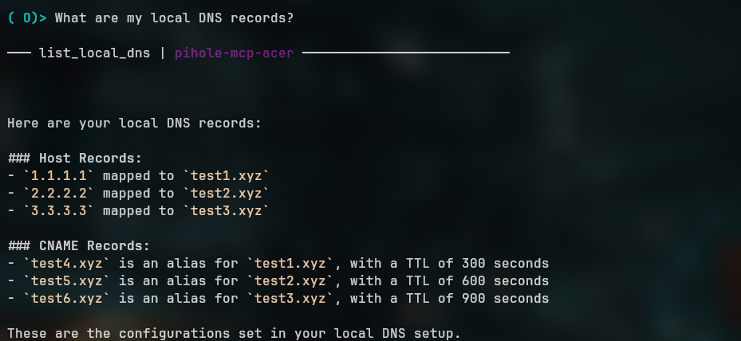
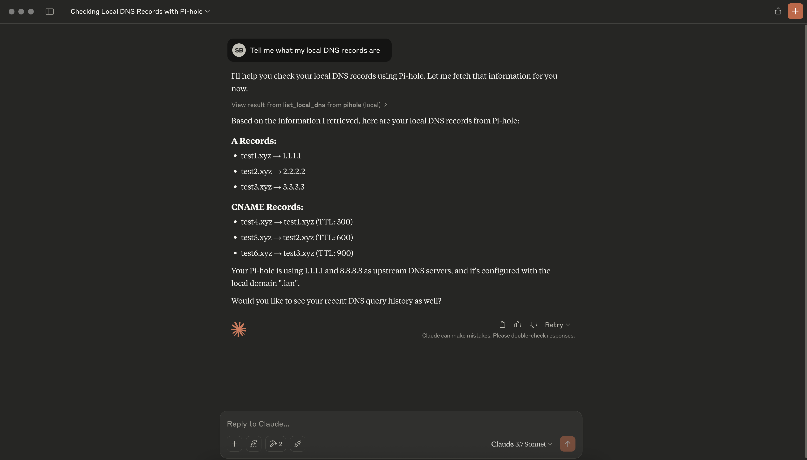
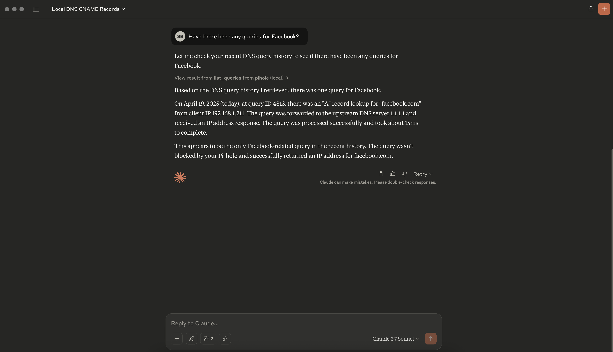

# 🍓 pihole-mcp-serer

A Model Context Protocol (MCP) server for Pi-hole. This server exposes Pi-hole functionality as tools that can be used by AI assistants.

## Dependencies

### Docker

- [Docker install guide](https://docs.docker.com/engine/install/)

### `uv` (Optional, for Development)

If you want to run the application locally, use `uv`. Install it with your package manager of choice.

## Environment

Create a `.env` file in the project root with your Pi-hole credentials:

```
# Primary Pi-hole (required)
PIHOLE_URL=https://your-pihole.local/
PIHOLE_PASSWORD=your-admin-password
#PIHOLE_NAME=Primary        # optional, defaults to URL if unset

# Secondary Pi-hole (optional)
#PIHOLE2_URL=https://secondary-pihole.local/
#PIHOLE2_PASSWORD=password2
#PIHOLE2_NAME=Secondary     # optional

# Up to 4 Pi-holes:
#PIHOLE3_URL=...
#PIHOLE3_PASSWORD=...
#PIHOLE3_NAME=...

#PIHOLE4_URL=...
#PIHOLE4_PASSWORD=...
#PIHOLE4_NAME=...
```

## Project Structure

The project follows a modular organization for better maintainability:

```
/
├── main.py                # Main application entry point
├── tools/                 # Pi-hole tools organized by functionality
│   ├── __init__.py
│   ├── config.py          # Configuration-related tools (DNS settings)
│   └── metrics.py         # Metrics and query-related tools
├── resources/             # MCP resources
│   ├── __init__.py
│   └── common.py          # Common resources (piholes://, version://)
├── docker-compose.yml     # Docker Compose configuration for production
├── docker-compose.dev.yml # Docker Compose for development with volume mounts
└── Dockerfile             # Docker build configuration
```

This structure separates the code into logical components while maintaining compatibility with all run modes.

## Running the Server

There are several ways to run the Pi-hole MCP server:

### Using Docker (Recommended for Production)

```bash
# Standard deployment
docker-compose up -d
```

The server will be available at `http://localhost:8383`

### Development Mode with Docker

For development, use the dev compose file which builds locally:

```bash
docker-compose -f docker-compose.dev.yml up
```

### MCP Inspector

You can run the MCP inspector using `uv` and the `mcp` CLI:

```bash
uv run mcp dev main.py
```

This will start an interactive interface at `http://localhost:6274` where you can test tools and resources.

## API

This MCP server exposes the following resources and tools:

### Resources

- `piholes://`: Returns information about all configured Pi-holes
- `version://`: Returns the MCP server version
- `list-tools://`: Returns a list of tool categories
  - `list-tools://{category}`: Returns a list of tools within a specific category

### Tools

Each tool call returns results as a list of dictionaries with the following structure:
```
[
  {
    "pihole": "Pi-hole Name",
    "data": [...]  # Result data from this Pi-hole
  },
  ...
]
```

#### Configuration

- `list_local_dns`: Lists all local DNS settings from Pi-hole(s)
- `add_local_a_record`: Adds a local A record to Pi-hole(s).
- `add_local_cname_record`: Adds a local CNAME record to Pi-hole(s).
- `remove_local_a_record`: Removes all A records for a hostname.
- `remove_local_cname_record`: Removes all CNAME records for a hostname.

#### Metrics

- `list_queries`: Fetches the recent DNS query history from Pi-hole(s)
- `list_query_suggestions`: Get query filter suggestions
- `list_query_history`: Get activity graph data for queries over time

## Testing in `goose`

Goose is a CLI LLM client that's useful for testing and development. Follow their install instructions [here](https://block.github.io/goose/docs/quickstart/).

The following assumes you've completed the initial setup with `goose configure`.

### Configure Extension

1. Type `goose configure` to open the configuration menu.
2. Select **Add Extension**
3. Select **Remote Extension**
4. It will ask for a name. It doesn't matter what you name it. I called mine `pihole-mcp`.
5. When it asks _"What is the SSE endpoint URI?"_ enter `http://localhost:8383/sse`.
6. Enter a timeout.
7. Add a description if you'd like.
8. Select **No** when it asks about environment variables.
   

### Start a Session

Once the server is installed, start a chat session.

```sh
goose session
```

Try asking it: _"What are my local DNS records?"_



...or telling it: _"Show me my recent DNS queries."_


## Claude Desktop

Claude's desktop client currently only support's the STDIO protocol, however you can use a proxy to communicate with the SSE endpoint.

Add the following to your `claude_desktop_config.json` file.

```json
{
  "mcpServers": {
    "pihole": {
      "command": "npx",
      "args": [
        "mcp-remote",
        "http://localhost:8383/sse"
      ]
    }
  }
}
```

If you're connecting to a different host on your local network and using an unsecured connection, you'll need to explicitly allow it with the `--allow-http` argument. For example:

```json
{
  "mcpServers": {
    "pihole": {
      "command": "npx",
      "args": [
        "mcp-remote",
        "http://192.168.1.255:8383/sse",
        "--allow-http"
      ]
    }
  }
}
```

Afterwards, completely restart the application and try it out.





## License

[MIT](./LICENSE)